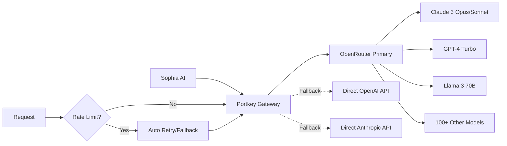

# Sophia AI - LLM Gateway Configuration

## Overview

Sophia AI uses a unified LLM gateway approach with **Portkey + OpenRouter** to provide access to 100+ language models with automatic fallbacks, rate limiting, and caching.

## 🚀 Quick Setup

### Minimal Configuration (Recommended)
```env
# Just 2 API keys for full LLM capabilities
LLM_GATEWAY=portkey
PORTKEY_API_KEY=your-portkey-api-key-here
OPENROUTER_API_KEY=your-openrouter-api-key-here
```

This configuration provides:
- ✅ Access to 100+ models (Claude, GPT-4, Llama, etc.)
- ✅ Automatic fallbacks between providers
- ✅ Built-in rate limiting and retry logic
- ✅ Semantic caching for cost optimization
- ✅ Single billing through OpenRouter

## 🏗️ Architecture



## 📦 Available Models

Through OpenRouter, you get access to:

### Top Tier Models
- **Anthropic**: Claude 3 Opus, Claude 3 Sonnet, Claude 2.1
- **OpenAI**: GPT-4 Turbo, GPT-4, GPT-3.5 Turbo
- **Google**: Gemini Pro, PaLM 2
- **Meta**: Llama 3 70B, Llama 3 8B

### Specialized Models
- **Code**: Code Llama, StarCoder, DeepSeek Coder
- **Math**: Qwen Math, Minerva
- **Creative**: Mixtral, Yi 34B
- **Fast**: Mistral 7B, Phi-2

## 🔧 Configuration Details

### Backend Integration
The LLM gateway is configured in `backend/integrations/llm_gateway.py`:

```python
from backend.integrations.llm_gateway import get_llm_gateway

# Get the gateway instance
gateway = get_llm_gateway()

# Simple completion
response = await gateway.complete(
    messages=[
        {"role": "system", "content": "You are a helpful assistant."},
        {"role": "user", "content": "Analyze this business data..."}
    ],
    model="openrouter/anthropic/claude-3-opus",  # Optional, uses default
    temperature=0.7,
    max_tokens=4096
)

# Stream completion
async for chunk in gateway.stream_complete(messages):
    print(chunk)
```

### Model Selection Strategy
```python
# Default model (highest quality)
default_model = "openrouter/anthropic/claude-3-opus"

# Automatic fallbacks (in order)
fallback_models = [
    "openrouter/anthropic/claude-3-sonnet",  # Faster, cheaper
    "openrouter/openai/gpt-4-turbo",         # Alternative top tier
    "openai/gpt-4-turbo-preview",            # Direct API fallback
    "anthropic/claude-3-sonnet-20240229"     # Direct API fallback
]
```

## 💰 Cost Optimization

### Semantic Caching
- Automatically caches similar requests
- Reduces API calls by up to 40%
- Configurable cache TTL

### Smart Model Routing
```python
# Use cheaper models for simple tasks
simple_tasks = ["classification", "extraction"] 
# → Routes to Sonnet or GPT-3.5

# Use powerful models for complex tasks  
complex_tasks = ["analysis", "generation", "reasoning"]
# → Routes to Opus or GPT-4
```

## 🔐 Security

- API keys stored in environment variables
- All requests proxied through Portkey
- No direct exposure of provider keys
- Request/response logging for audit

## 📊 Monitoring

The gateway provides:
- Request latency tracking
- Token usage monitoring  
- Error rate tracking
- Provider availability status

Access monitoring at:
- Portkey Dashboard: https://app.portkey.ai
- OpenRouter Dashboard: https://openrouter.ai/dashboard

## 🆘 Troubleshooting

### Common Issues

1. **Rate Limits**
   - Gateway automatically handles with exponential backoff
   - Falls back to next available provider

2. **Model Availability**
   ```python
   # Check available models
   models = gateway.get_available_models()
   ```

3. **API Key Issues**
   - Verify keys in `.env` file
   - Check Portkey dashboard for virtual key status
   - Ensure OpenRouter account has credits

### Debug Mode
```python
# Enable debug logging
import logging
logging.getLogger("backend.integrations.llm_gateway").setLevel(logging.DEBUG)
```

## 🚀 Advanced Features

### Custom Routing
```python
# Route specific requests to specific providers
config = LLMConfig(
    portkey_api_key="...",
    openrouter_api_key="...",
    default_model="openrouter/meta-llama/llama-3-70b",  # Use Llama for cost
    fallback_models=["openrouter/anthropic/claude-3-opus"]  # Fallback to Claude
)
```

### Parallel Processing
```python
# Process multiple requests in parallel
tasks = [
    gateway.complete(messages1),
    gateway.complete(messages2),
    gateway.complete(messages3)
]
results = await asyncio.gather(*tasks)
```

## 📈 Best Practices

1. **Model Selection**
   - Use Opus for complex reasoning
   - Use Sonnet for balanced performance/cost
   - Use GPT-3.5 for simple tasks

2. **Prompt Engineering**
   - Include clear instructions
   - Use few-shot examples
   - Specify output format

3. **Cost Management**
   - Monitor usage in dashboards
   - Set spending limits
   - Use caching effectively

## 🔗 Resources

- [Portkey Documentation](https://docs.portkey.ai)
- [OpenRouter Models](https://openrouter.ai/models)
- [Pricing Calculator](https://openrouter.ai/pricing)
- [API Reference](https://openrouter.ai/docs)

---

**Note**: This setup provides maximum flexibility with minimal configuration. Start with the 2-key setup and add direct provider keys only if needed for specific requirements. 